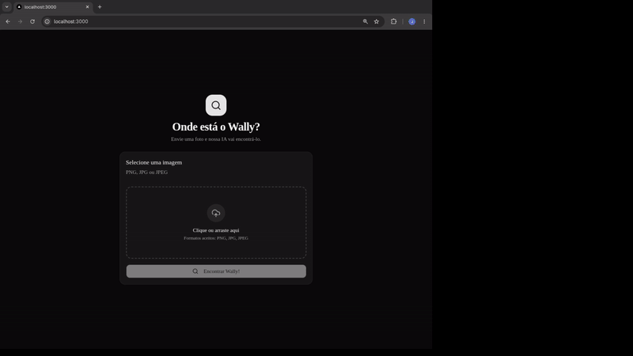

# Onde Está o Waldo?

Este repositório contém o projeto que usei para estudar redes convolucionais aplicadas à identificação de padrões em imagens. Decidi utilizar o desafio "Onde Está o Waldo?" por causa de uma tentativa que fiz algumas semanas atrás, mas que não teve um resultado muito bom.
Então, eu queria provar para mim mesmo que, estudando mais sobre o tema, conseguiria concluir o projeto. E, aparentemente, consegui! Um modelo usando RCNN que encontra o Waldo em uma multidão! 😄

<p align="center">
  
</p>


## Estrutura do Projeto

- **`api/`**: Uma API em FastAPI que carrega o modelo responsável por encontrar o Waldo.
- **`web/`**: Um front-end simples para facilitar os testes.
- **[`model/`](./model/README.md)**: Aqui estão minhas anotações e estudos que considerei relevantes durante o processo de aprendizado e treinamento do modelo.
    

## Início Rápido (Docker Compose)

Você pode executar toda a aplicação (front-end + API) facilmente utilizando o Docker Compose.

1. Compile e inicie os serviços:
    
    ```bash
    docker-compose up --build -d
    ```
    
2. Acesse o front-end em:
    
    ```
    http://localhost:3000
    ```
    
3. A API estará disponível em:
    
    ```
    http://localhost:8001
    ```
    
## Treinamento do Modelo

Caso queira treinar o modelo, você pode utilizar o `model/Dockerfile` dedicado para essa finalidade.

Consulte o arquivo `model/README.md` para obter instruções sobre como montar o dataset e executar os scripts de treinamento utilizando Docker.
